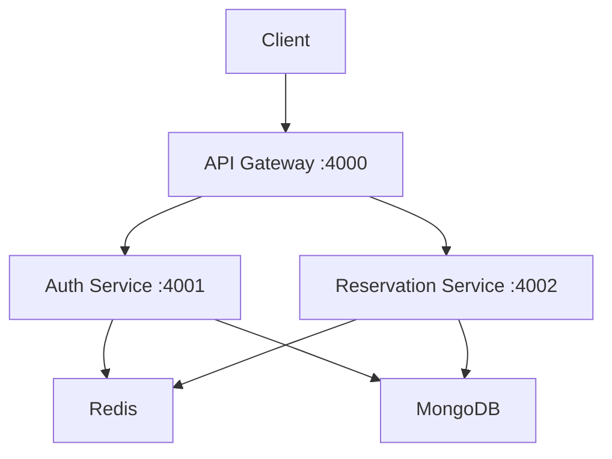

# ☕ Cafe Reservation System

**Production-ready microservices backend** featuring distributed authentication, reservation management with concurrency safety, and API gateway routing.

🔗 [Live Demo](https://cafe-reservation.netlify.app/) | 📋 [Docs](#quick-start)

---

## 🎯 Tech Stack

`Node.js` • `Express.js` • `MongoDB` • `Redis` • `JWT`

---

## ⚡ Key Features

| Feature | What It Does |
|---------|-------------|
| **🔒 JWT Auth** | Role-based access control (ADMIN/USER) with secure token issuance |
| **🛡️ Zero Double-Bookings** | Redis locks + MongoDB unique indexes prevent race conditions |
| **📡 Distributed Locking** | Redis NX EX prevents concurrent writes across multiple instances |
| **⚙️ Microservices** | 3 independent services: API Gateway, Auth, Reservations |
| **🧪 Stress Tested** | 50+ concurrent requests validated with zero conflicts |

---

## 🏗️ Architecture



**Services:**
- **api-gateway** (4000) — Single entry point, JWT validation, RBAC
- **auth-service** (4001) — User registration, login, token generation
- **reservation-service** (4002) — Tables, menus, reservations, availability


---

## 🔑 Demo Credentials

| Role | Email | Password |
|------|-------|----------|
| Admin | admin@gmail.com | 123456 |
| Admin | superadmin@gmail.com | 123456 |
| User | sahil@gmail.com | 123456 |
| User | user@gmail.com | 123456 |

---

## 🔐 Security

- **JWT verification at Gateway** — All requests validated with proper tokens
- **Role-Based Access Control (RBAC)** — Different permissions for ADMIN/USER roles
- **Services trust gateway headers** — Internal isolation between services
- **Strict permission enforcement** — USER vs ADMIN fully separated

---

## 🔧 Local Setup (Quick)

### Prerequisites
- Node.js (16+), npm
- MongoDB (local or hosted)
- Redis (local or hosted)

### Environment Configuration
Create `.env` files in each service folder with the following examples:

#### api-gateway/.env
```
PORT=4000
SERVICE_NAME=api-gateway
AUTH_SERVICE_URL=http://localhost:4001
RESERVATION_SERVICE_URL=http://localhost:4002
JWT_SECRET=your_jwt_secret_here
```

#### auth-service/.env
```
PORT=4001
SERVICE_NAME=auth-service
MONGO_URI=mongodb://localhost:27017/caff-auth
JWT_SECRET=your_jwt_secret_here
```

#### reservation-service/.env
```
PORT=4002
SERVICE_NAME=reservation-service
MONGO_URI=mongodb://localhost:27017/caff-reservations
REDIS_URL=redis://127.0.0.1:6379
```

### Starting Services
Run the following commands from the repo root or inside each folder:

```bash
# API Gateway
cd api-gateway && npm install && npm run dev

# Auth Service
cd auth-service && npm install && npm run dev

# Reservation Service
cd reservation-service && npm install && npm run dev
```

---

## ⚙️ Concurrency Details

The booking flow employs **two layers of safety** to ensure resilience:

1. **Redis Lock**: `SET lock:<tableId>:<date>:<timeSlot> <userId> NX EX 60` — Prevents concurrent writes for 60 seconds.
2. **MongoDB Unique Index**: On `{ tableId, date, timeSlot }` — Acts as a final guard against accidental double-booking.

### ⚡ Concurrency (BIG WIN)
- **Redis SET NX EX locking** — Distributed locks prevent race conditions across multiple instances
- **MongoDB unique compound index** — Database-level constraint ensures data integrity
- **Stress tested (50+ concurrent requests)** — Validated under high load scenarios
- **Exactly 1 success, rest rejected ✅** — Perfect concurrency control with zero double-bookings

These mechanisms combined make the system robust against race conditions and unexpected crashes.

---

## 🧰 Tests

The reservation service includes dedicated test scripts for validating concurrency and performance:

- `concurrent-booking-test.js` — Simulates 2 simultaneous booking attempts for the same slot (update `tableId` as needed).
- `stress-booking-test.js` — Floods the booking endpoint with multiple requests to analyze success/failure rates.
- `test-redis.js` — Verifies basic Redis lock behavior.

Run them with Node.js:

```bash
cd reservation-service
node concurrent-booking-test.js
node stress-booking-test.js
node test-redis.js
```

---

---

## 📝 Notes

- **Frontend** — React frontend already built and deployed at [cafe-reservation.netlify.app](https://cafe-reservation.netlify.app/)
- **Docker** — Ready for containerization with `docker-compose.yml`
- **Testing** — Full concurrency test suite included

---

## License

MIT

